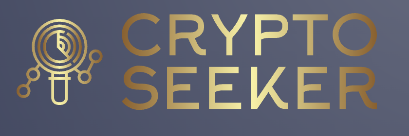
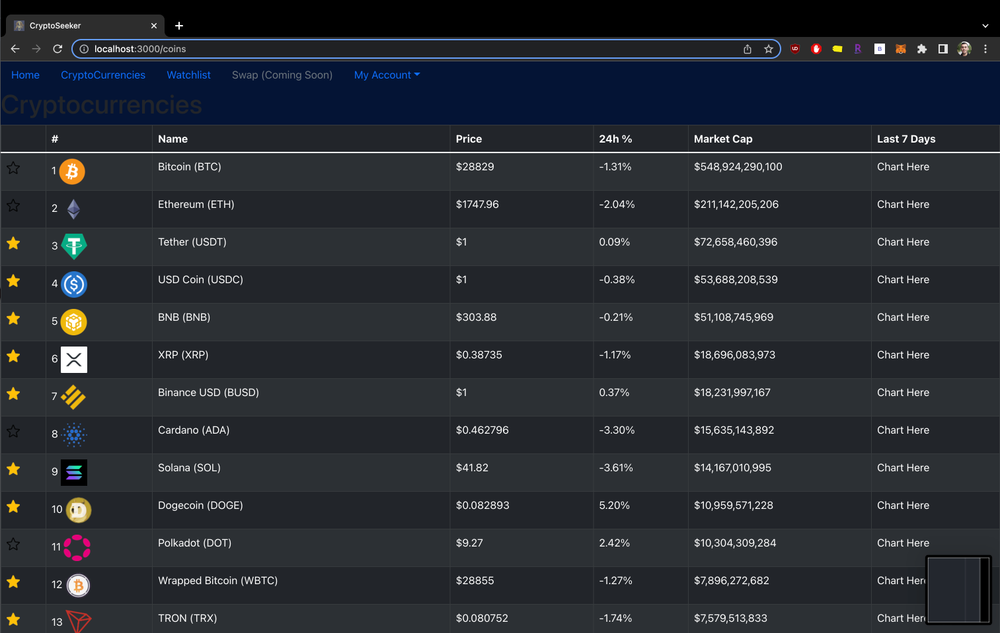
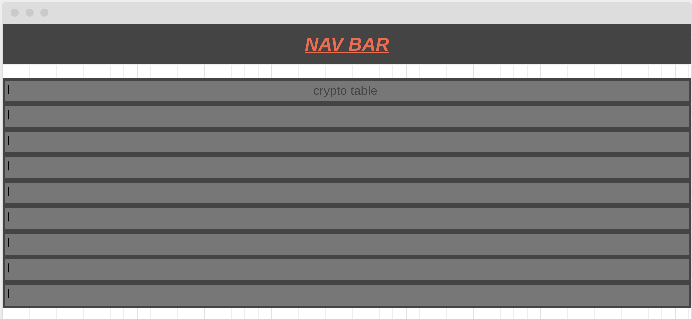
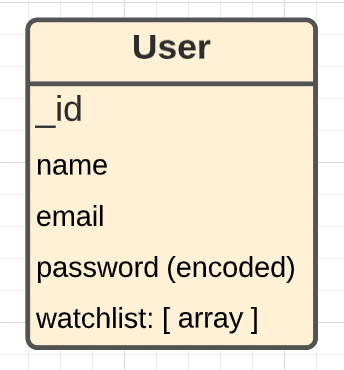

## Project 4 - Crypto Seeker (Full-Stack React App)(SPA)

### About the Project

Crypto Seeker is your one stop shop for managing your crypto portfolio. See the top coins and add your favourite cryptocurrencies to your watchlist to keep an eye out for them in the future.

In our next major update, we will be introducing the ability to be able to connect your MetaMask wallet and be able to make transactions in converting currencies. Keep an eye out!

### Technologies Used

- MongoDB/Mongoose
- Express
- React
- Node
- JSON Web Tokens (JWT)
- API (CoinGecko)

### Getting Started

- Link to the deployed app is here: [CryptoSeeker (not linked yet)](https://github.com/git-Ge0rge)
- Here is my [Trello Board](https://trello.com/b/m2YgX9bA/project-4-crypto-tracker)

### Screenshots

### Wireframe

### ERD

- More relationships will be added as feature updates get pushed out. (e.g. one to many relationship with users and MetaMask wallets as one user can have many wallets)

### Next Steps / Ice Box Features

- AAU I want to convert to my domiciled currency
- AAU I want to be able to sign in with my Google account
- AAU I want to be able to see more detailed information about a specific cryptocurrency
- AAU I want to be able to link my MetaMask wallet to make coin trades
